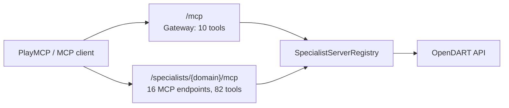

# Disclosure Compass 구현·배포 기록

마지막 갱신: **2026-07-18 KST**. 이 문서는 16개 OpenDART 전문 MCP 서버와
82개 도구를 공개 PlayMCP 구조로 만드는 현재 구현을 설명한다.

## 1. 배포 구조



v1.2.1은 하나의 ASGI 컨테이너 안에 17개 Streamable HTTP endpoint를 만든다.

- `/mcp`: 기존 호환성용 gateway MCP, 10개 도구
- `/specialists/<domain-id>/mcp`: PlayMCP에 개별 등록할 16개 전문 MCP
- `/health`: 컨테이너 health check

전문 MCP는 네트워크상 서로 다른 endpoint라서 PlayMCP의 서버별 최대 20개 도구
제한을 만족한다. 실제로 도구 수는 2-9개다. 단일 92개 도구 endpoint 후보(v1.1.0)는
이 제한 때문에 배포 대상에서 제외했다.

## 2. 16개 전문 서버와 82개 도구

| domain ID | 도구 수 | 공개 경로 |
| --- | ---: | --- |
| `disclosure_search` | 4 | `/specialists/disclosure_search/mcp` |
| `shareholder_stock` | 8 | `/specialists/shareholder_stock/mcp` |
| `executive_compensation` | 9 | `/specialists/executive_compensation/mcp` |
| `debt_securities` | 6 | `/specialists/debt_securities/mcp` |
| `audit_fund` | 5 | `/specialists/audit_fund/mcp` |
| `financial_statement` | 7 | `/specialists/financial_statement/mcp` |
| `equity_disclosure` | 2 | `/specialists/equity_disclosure/mcp` |
| `securities_registration` | 6 | `/specialists/securities_registration/mcp` |
| `capital_change` | 4 | `/specialists/capital_change/mcp` |
| `treasury_stock` | 4 | `/specialists/treasury_stock/mcp` |
| `convertible_securities` | 4 | `/specialists/convertible_securities/mcp` |
| `merger_division` | 4 | `/specialists/merger_division/mcp` |
| `business_transfer` | 5 | `/specialists/business_transfer/mcp` |
| `overseas_listing` | 4 | `/specialists/overseas_listing/mcp` |
| `equity_investment` | 3 | `/specialists/equity_investment/mcp` |
| `corporate_issues` | 7 | `/specialists/corporate_issues/mcp` |
| **합계** | **82** | **16 MCP endpoint** |

정확한 82개 도구명, OpenDART endpoint, 한국어 라벨은
[`SPECIALIST_TOOLS`](../src/opendart_mcp/specialists.py)에 단일 원천으로 정의되어
있다. 전문 도구는 원래 `dart_*` 이름을 유지한다.

## 3. 구현 변경

### `src/opendart_mcp/specialists.py`

- 16개 `FastMCP` 인스턴스를 생성하고 82개 도구를 해당 서버에만 등록한다.
- 모든 도구가 PlayMCP 필수 annotation을 선언한다.
  `readOnlyHint=true`, `destructiveHint=false`, `openWorldHint=true`,
  `idempotentHint=true`
- 설명에는 `Disclosure Compass(공시나침반)`과 `OpenDART (전자공시시스템 DART)`를
  포함한다.
- `specialist_mcp_path()`가 각 공개 URL 경로를 한 곳에서 계산한다.

### `src/opendart_mcp/server.py`

- gateway는 10개 도구만 유지한다.
- Starlette가 전문 FastMCP HTTP 앱 16개와 gateway 앱을 mount한다.
- 부모 ASGI lifespan에서 17개 FastMCP session manager를 함께 시작·종료한다. 이 과정이
  없으면 HTTP 호출 시 FastMCP task group 초기화 오류가 발생한다.
- `main()`은 `uvicorn`으로 통합 ASGI 앱을 기동한다.

### 실행과 secret

```bash
export DART_API_KEY='runtime secret only'
opendart-mcp
```

`DART_API_KEY`는 OpenDART 호출에만 사용한다. 소스, Git, 이미지 레이어, PlayMCP
설명에 넣지 않는다. Dockerfile은 기본 포트 `8000`에서 위 ASGI 앱을 실행한다.

기존 심사 완료 gateway가 `DART_API_KEY`를 이미 보유할 때에는 새 edge 컨테이너에
`OPENDART_UPSTREAM_GATEWAY_URL`만 설정할 수 있다. 이 옵션은 전문 tool 호출을
gateway의 `call_disclosure_server_tool`로 전달하므로 API key를 복사하지 않는다.
새 edge 자신의 URL을 upstream으로 지정하지 않으며, 장기적으로는 독립 host의
`DART_API_KEY` secret으로 직접 OpenDART를 호출한다.

## 4. 검증 증거

v1.2.1 로컬 검증 결과:

```text
pytest tests/test_server.py tests/test_specialists.py: 107 passed
HTTP Client 검증: gateway_tools=10
HTTP Client 검증: specialist_servers=16
HTTP Client 검증: specialist_tools=82
```

HTTP 검증은 실제 `uvicorn` 프로세스에 FastMCP Client로 연결해 모든 공개 전문 URL의
`tools/list`을 비교했다. 각 도구 이름이 레지스트리와 같고, 서버별 도구 수가 20 이하임을
확인했다. 전체 저장소 검증은 다음 명령으로 한다.

```bash
uv run ruff check src tests
uv run pytest -q
uv run python -m compileall -q src tests
```

## 5. PlayMCP 등록·배포 상태

2026-07-18 실제 `playmcp.kakao.com` 개발자 콘솔에는 심사 완료된
`Disclosure Compass(공시나침반)` (`dartcompass`) 1개가 있으며, endpoint는
`https://disclosure-compass.playmcp-endpoint.kakaocloud.io/mcp`, 콘솔 표시 도구 수는
6개다. 같은 endpoint의 실제 `tools/list`은 gateway 10개를 반환한다. 콘솔 도구 수는
자동 갱신되지 않을 수 있으므로, 실제 배포 판정은 원격 `tools/list`으로 한다. 어느
관측값으로 보아도 v1.2.1의 16개 전문 endpoint와 82개 도구는 아직 반영되지 않았다.

PlayMCP 콘솔은 원격 MCP endpoint를 등록하고 도구 정보를 불러오는 화면이다. 따라서
다음 두 작업 모두 완료되어야 한다.

1. v1.2.1 Docker 이미지를 공개 HTTPS 호스트에 배포한다. 독립 direct 모드는
   `DART_API_KEY`, 전환 edge 모드는 기존 gateway URL만 필요하다.
2. 16개 `/specialists/<domain-id>/mcp` URL을 PlayMCP에 임시 등록·검증한 뒤 심사
   요청한다.

정확한 콘솔 입력값과 갱신 순서는
[카카오 PlayMCP 운영·갱신 핸드북](KAKAO_PLAYMCP_OPERATIONS_KO.md)을 따른다.
