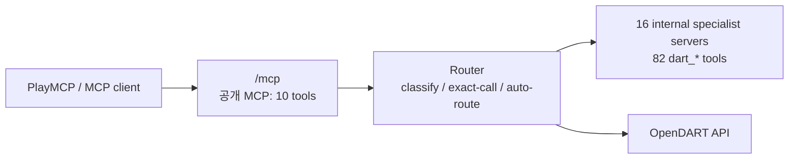

# Disclosure Compass 구현·배포 기록

마지막 갱신: **2026-07-19 KST**. 이 문서는 단일 공개 PlayMCP MCP가 16개
OpenDART 전문 서버와 82개 도구를 내부적으로 라우팅하는 현재 구현을 설명한다.

## 1. 배포 구조



v1.2.2는 하나의 ASGI 컨테이너에서 공개 PlayMCP endpoint 하나를 제공한다.

- `/mcp`: PlayMCP에 등록하는 단일 gateway MCP, 10개 도구
- `/specialists/<domain-id>/mcp`: 16개 내부 전문 서버의 진단·호환 경로이며 PlayMCP에
  별도 등록하지 않음
- `/health`: 컨테이너 health check

PlayMCP가 보게 되는 도구는 gateway의 10개이므로 서버별 최대 20개 제한을 만족한다.
82개 `dart_*` 도구를 단일 `tools/list`에 노출하지 않고, `route_and_call_disclosure`
또는 `call_disclosure_server_tool`이 내부 전문 서버를 통해 실행한다.

## 2. 16개 내부 전문 서버와 82개 도구

| domain ID | 도구 수 | 내부 경로 |
| --- | ---: | --- |
| `disclosure_search` | 4 | `/specialists/disclosure_search/mcp` |
| `shareholder_stock` | 8 | `/specialists/shareholder_stock/mcp` |
| `executive_compensation` | 9 | `/specialists/executive_compensation/mcp` |
| `debt_securities` | 6 | `/specialists/debt_securities/mcp` |
| `audit_fund` | 5 | `/specialists/audit_fund/mcp` |
| `financial_statement` | 7 | `/specialists/financial_statement/mcp` |
| `equity_disclosure` | 2 | `/specialists/equity_disclosure/mcp` |
| `securities_registration` | 6 | `/specialists/securities_registration/mcp` |
| `capital_change` | 4 | `/specialists/capital_change/mcp` |
| `treasury_stock` | 4 | `/specialists/treasury_stock/mcp` |
| `convertible_securities` | 4 | `/specialists/convertible_securities/mcp` |
| `merger_division` | 4 | `/specialists/merger_division/mcp` |
| `business_transfer` | 5 | `/specialists/business_transfer/mcp` |
| `overseas_listing` | 4 | `/specialists/overseas_listing/mcp` |
| `equity_investment` | 3 | `/specialists/equity_investment/mcp` |
| `corporate_issues` | 7 | `/specialists/corporate_issues/mcp` |
| **합계** | **82** | **16 internal specialist server** |

정확한 82개 도구명, OpenDART endpoint, 한국어 라벨은
[`SPECIALIST_TOOLS`](../src/opendart_mcp/specialists.py)에 단일 원천으로 정의되어
있다. 전문 도구는 원래 `dart_*` 이름을 유지한다.

## 3. 구현 변경

### `src/opendart_mcp/specialists.py`

- 16개 `FastMCP` 인스턴스를 생성하고 82개 도구를 해당 서버에만 등록한다.
- 모든 도구가 PlayMCP 필수 annotation을 선언한다.
  `readOnlyHint=true`, `destructiveHint=false`, `openWorldHint=true`,
  `idempotentHint=true`
- 설명에는 `Disclosure Compass(공시나침반)`과 `OpenDART (전자공시시스템 DART)`를
  포함한다.
- `specialist_mcp_path()`가 진단·호환용 전문 경로를 한 곳에서 계산한다.

### `src/opendart_mcp/server.py`

- gateway는 10개 공개 도구만 유지하며, 6개 직접 조회 도구와 4개 라우팅 도구 모두
  `SpecialistServerRegistry`를 통해 내부 서버로 위임한다.
- Starlette가 gateway 앱과 전문 FastMCP HTTP 앱 16개를 mount한다. PlayMCP 등록에는
  gateway 앱만 사용한다.
- 부모 ASGI lifespan에서 17개 FastMCP session manager를 함께 시작·종료한다. 이 과정이
  없으면 HTTP 호출 시 FastMCP task group 초기화 오류가 발생한다.
- `main()`은 `uvicorn`으로 통합 ASGI 앱을 기동한다.

### 실행과 secret

```bash
export DART_API_KEY='runtime secret only'
opendart-mcp
```

`DART_API_KEY`는 OpenDART 호출에만 사용한다. 소스, Git, 이미지 레이어, PlayMCP
설명에 넣지 않는다. Dockerfile은 기본 포트 `8000`에서 위 ASGI 앱을 실행한다.

기존 심사 완료 gateway가 `DART_API_KEY`를 이미 보유할 때에는 새 edge 컨테이너에
`OPENDART_UPSTREAM_GATEWAY_URL`만 설정할 수 있다. 이 옵션은 전문 tool 호출을
gateway의 `call_disclosure_server_tool`로 전달하므로 API key를 복사하지 않는다.
새 edge 자신의 URL을 upstream으로 지정하지 않으며, 장기적으로는 독립 host의
`DART_API_KEY` secret으로 직접 OpenDART를 호출한다.

## 4. 검증 증거

v1.2.2 로컬 검증 결과:

```text
gateway tools=10 (all delegate through the specialist registry)
internal specialist servers=16
internal specialist tools=82
public route_and_call_disclosure: disclosure_search -> dart_company -> status=ok
```

HTTP 검증은 공개 `/mcp`의 `tools/list`과 실제 자동 라우팅 호출을 확인한다. 이어서
내부 전문 registry의 16개 서버와 82개 도구가 완전한 분할인지 확인한다. 전체 저장소
검증은 다음 명령으로 한다.

```bash
uv run ruff check src tests
uv run pytest -q
uv run python -m compileall -q src tests
```

## 5. PlayMCP 등록·배포 상태

2026-07-19 실제 `playmcp.kakao.com` 개발자 콘솔에는 심사 완료된
`Disclosure Compass(공시나침반)` (`dartcompass`) 1개가 있으며, endpoint는
`https://disclosure-compass.playmcp-endpoint.kakaocloud.io/mcp`, 콘솔 표시 도구 수는
6개다. 같은 endpoint의 실제 `tools/list`은 gateway 10개를 반환한다. 콘솔 도구 수는
자동 갱신되지 않을 수 있으므로, 실제 배포 판정은 원격 `tools/list`으로 한다. 어느
관측값으로 보아도 기존 카드는 라우터 구조를 반영하지 않는다.

PlayMCP 콘솔은 원격 MCP endpoint를 등록하고 도구 정보를 불러오는 화면이다. 현재
v1.2.1은 Cloud Run `disclosure-compass-specialists` revision
`disclosure-compass-specialists-00001-rnv`에 공개 배포됐다.

```text
https://disclosure-compass-specialists-91883774911.asia-northeast3.run.app
```

2026-07-19에 임시 등록 MCP `공시나침반 공시 검색` (`dartSearch`)의 endpoint를
`https://disclosure-compass-specialists-91883774911.asia-northeast3.run.app/mcp`로
교체하고 정보를 불러왔다. 콘솔은 Tools **10**, Online을 표시하며 심사 요청 상태다.
이 10개 gateway 도구의 `route_and_call_disclosure`와
`call_disclosure_server_tool`은 16개 내부 전문 서버와 82개 `dart_*` 도구를 실행한다.

v1.2.2는 동일한 단일 gateway contract에서 6개 직접 조회 도구도 내부 전문 registry로
위임하도록 보강한다. 이 수정은 새 Cloud Run revision으로 배포한 뒤 `/mcp` 실제 호출로
검증해야 한다.

정확한 콘솔 입력값과 갱신 순서는
[카카오 PlayMCP 운영·갱신 핸드북](KAKAO_PLAYMCP_OPERATIONS_KO.md)을 따른다.
