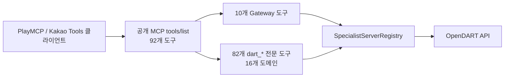

# 카카오 PlayMCP 운영·갱신 핸드북

이 문서는 `Disclosure Compass (공시나침반)`의 카카오 PlayMCP in KC 배포와
PlayMCP 공개 MCP 표면을 구분해 기록한 운영 기준이다. 이전 커밋, 현재 소스,
원격 MCP 프로토콜 응답, 카카오의 공개 안내를 함께 대조했다.

마지막 검증: **2026-07-18 22:10 KST**

> 이 시각의 **기존 원격 endpoint(v1.0.0)** 는 10개만 공개했다. 이후 작업공간의
> **v1.1.0** 은 82개 전문 Tool을 최상위 MCP 도구로 등록했고, 새 PlayMCP endpoint에
> 배포해 원격 검증하는 단계다. 기존 endpoint의 관측값과 새 release candidate를
> 혼동하지 않는다.

## 1. 도구 공개 상태: 기존 배포 10개, v1.1.0 배포 목표 92개

기존 원격 MCP endpoint의 `tools/list` 응답은 **10개**다. v1.1.0은 16개 전문
도메인의 **82개 OpenDART 도구**를 동일 endpoint의 최상위 MCP 도구로 직접
등록한다. 기존 Gateway 10개를 유지하므로 새 endpoint의 기대 공개 수는 **92개**다.

| 구분 | 기존 endpoint | v1.1.0 새 endpoint | 외부에서 직접 보이는가 |
| --- | ---: | --- | --- |
| PlayMCP 공개 MCP 도구 | 10 | 92 (10 Gateway + 82 전문) | 예 |
| 전문 도메인 | 16 | 16 | 도구의 설명·tag·인벤토리로 보존 |
| OpenDART 전문 도구 | 82, 내부 호출만 | 82, `dart_*` 직접 호출 가능 | 예 |

따라서 “약 80개가 카카오에 등록되어야 한다”가 **카카오 클라이언트의 도구 선택
목록에 약 80개가 직접 보여야 한다**는 뜻이라면, v1.1.0은 이 요구를 구현했다.
카카오 endpoint에 반영하려면 코드 push 뒤 새 endpoint를 배포하고 `tools/list`가
92개를 돌려주는지 확인해야 한다.

반대로 10개 Gateway 도구를 통해 82개 기능을 호출할 수 있으면 충분하다는 요구라면
현재 설계는 의도대로 동작한다. `call_disclosure_server_tool`과
`route_and_call_disclosure`가 내부 전문 도구를 실행한다.



## 2. 현재 배포 사실

| 항목 | 확인값 |
| --- | --- |
| 서버 이름 / ID | `disclosure-compass` / `3506` |
| MCP endpoint | `https://disclosure-compass.playmcp-endpoint.kakaocloud.io/mcp` |
| health endpoint | `https://disclosure-compass.playmcp-endpoint.kakaocloud.io/health` |
| 배포 Git URL | `https://github.com/MLOpsEngineer/opendart-mcp.git` |
| 배포 ref | `main` |
| 기존 배포 source | `2f1a11175ea2fe6537da5fb1bfac80d0e8f426ad` (v1.0.0) |
| 현재 GitHub `main` / origin/main | `f9ab1374f1668d18e04c82c78f2e9bcd8a0fae61` (v1.1.0 후보) |
| Dockerfile / 컨테이너 포트 | `Dockerfile` / `8000` |
| 런타임 시크릿 | `DART_API_KEY` |
| 원격 health | HTTP 200, `status=ok`, version `1.0.0` |
| 원격 공개 도구 | 10개 (`dart_*` 직접 공개 0개) |
| 원격 내부 인벤토리 | 16개 서버, 82개 도구 |
| 새 release candidate | v1.1.0, 공개 도구 92개 기대 |
| 2026-07-18 콘솔 배포 게이트 | `새 MCP 서버 등록` 버튼 비활성화. 기존 서버 상세에는 `중지`·`삭제`와 모니터링만 있으며 소스 변경·재빌드 UI가 없음 |

원격 프로토콜 검증에 사용한 명령은 아래와 같다. API 키를 출력하거나 저장하지 않는다.

```bash
curl -fsS https://disclosure-compass.playmcp-endpoint.kakaocloud.io/health

.venv/bin/python - <<'PY'
import asyncio
from fastmcp import Client


async def main() -> None:
    async with Client(
        "https://disclosure-compass.playmcp-endpoint.kakaocloud.io/mcp"
    ) as client:
        public_tools = await client.list_tools()
        inventory = (await client.call_tool("list_disclosure_servers", {})).data
        print("public_tool_count =", len(public_tools))
        print("public_tool_names =", [tool.name for tool in public_tools])
        print("server_count =", inventory["server_count"])
        print("specialist_tool_count =", inventory["tool_count"])


asyncio.run(main())
PY
```

2026-07-18 22:10 KST 실측값은 공개 `10`, 직접 `dart_*` `0`, 내부 `16`, `82`다.
v1.1.0 새 endpoint의 통과 기준은 공개 `92`, 직접 `dart_*` `82`, 내부 `16`, `82`다.

## 3. 이전 이력이 남긴 의도

| 커밋 | 날짜 | 결정 |
| --- | --- | --- |
| `41ac136` | 2026-07-14 | 6개 읽기 전용 도구의 최소 공개 Streamable HTTP 서버를 만듦 |
| `cb5896a` | 2026-07-14 | 16개 도메인 분류기를 추가하되 비공개 LLM·벡터 의존성을 배제 |
| `2f1a111` | 2026-07-15 | 16개 내부 전문 서버·82개 어댑터를 추가하고, **외부 Gateway는 10개로 유지** |
| v1.1.0 작업 트리 | 2026-07-18 | 82개 `dart_*` 전문 Tool을 최상위 공개 MCP 표면에 추가 |

`2f1a111`의 명시 제약은 “외부 공개 gateway를 10개로 유지”하는 것이었다.
v1.1.0은 Gateway 호환성은 보존하면서 본선의 직접 도구 노출 요구를 충족하도록
그 제약을 확장했다.

## 4. 카카오에 코드 변경을 반영하는 경로

### 4.1 배포 서비스와 PlayMCP 공개 등록을 분리해서 본다

1. **PlayMCP in KC**는 Dockerfile을 Git 소스에서 빌드해 endpoint를 발급하는
   배포 서비스다.
2. **PlayMCP / Kakao Tools**는 그 endpoint의 MCP 프로토콜을 읽어 도구를 노출하는
   사용 표면이다.

즉, GitHub에 push만 해도 현재 endpoint가 자동 갱신된다고 가정하면 안 된다.
endpoint가 새 소스로 재빌드되어야 하고, 새 endpoint에서 `tools/list`가 원하는
도구 목록을 반환해야 한다.

### 4.2 현재 콘솔에서 확인된 입력값과 배포 게이트

`https://playmcp.kakaocloud.io/`의 공개 프런트엔드(2026-07-18 확인)는
**새 MCP 서버 등록 → Git 소스 빌드** 흐름과 다음 필드를 제공한다.

| 콘솔 입력 | 이 서버의 값 |
| --- | --- |
| MCP 서버 이름 | `disclosure-compass` 또는 새 검증용 이름 |
| Git URL | `https://github.com/MLOpsEngineer/opendart-mcp.git` |
| 브랜치 / ref | `main` 또는 배포 검증용 고정 커밋/브랜치 |
| Dockerfile 경로 | `Dockerfile` |
| PAT | 공개 저장소이므로 비움 |
| 컨테이너 포트 | `8000` |
| 시크릿 | `DART_API_KEY` |

Git 소스 빌드 화면은 Dockerfile, 환경변수·시크릿, 컨테이너 포트를 지원한다.
그러나 **2026-07-18 22:10 KST에 로그인한 동일 계정의 My MCP 화면에서 `새 MCP 서버 등록`
버튼은 비활성화**되어 있었다. 기존 서버 `3506` 상세에 노출된 lifecycle 동작은
`중지`·`삭제`뿐이고, 모니터링은 Istio RPS 조회뿐이다. 소스 ref 수정·재빌드·이미지
교체 UI는 확인되지 않았다.

따라서 현 시점에는 GitHub push만으로 기존 endpoint가 갱신되지 않으며, 콘솔만으로
v1.1.0을 배포할 수 없다. 이 문서의 "새 서버로 검증 후 전환"은 **등록이 다시
허용되거나 카카오 운영자가 본선 서비스에 재빌드 권한을 부여한 뒤의 절차**다.
비활성 버튼을 브라우저에서 우회하거나 기존 서버를 삭제·재생성하지 않는다.

### 4.3 안전한 갱신 절차

1. 로컬에서 변경을 완료하고 `ruff`, `pytest`, `compileall`을 통과시킨다.
2. 배포할 커밋을 `main`에 push한다. 현재 배포·원격 저장소가 같은 커밋인지
   `git rev-parse HEAD`와 `git rev-parse origin/main`으로 확인한다.
3. PlayMCP in KC에서 등록이 허용된 계정으로 로그인해 **새 MCP 서버 등록 → Git 소스 빌드**를
   연다. 버튼이 비활성화되었으면 본선 안내의 운영 채널에 아래 요청문을 전달해
   재빌드 또는 endpoint 교체 권한을 요청한다.
4. 4.2의 값을 입력하고 `DART_API_KEY`를 시크릿으로 다시 등록한다. 기존 시크릿 값은
   화면에서 읽어 문서화하거나 Git에 넣지 않는다.
5. 새 서버가 `Active`가 될 때까지 기다린 뒤 endpoint URL을 복사한다. 기존 서버
   ID `3506`은 삭제하지 않는다.
6. 새 endpoint에 대해 health, `tools/list`, 대표 OpenDART 호출을 실행한다.
7. **원격 검증이 통과한 endpoint만** PlayMCP 공개 등록/본선 운영 담당자에게
   전달한다. 최종 endpoint 교체가 확인되기 전에는 기존 endpoint를 유지한다.

카카오의 공개 공지는 참가자가 자신의 MCP 서버를 등록할 수 있고, 본선 20개 서비스는
Kakao Tools를 통해 노출된다고 설명한다. 본선에서 endpoint 교체를 참가자가 직접
할 수 있는지, 또는 카카오 운영 담당자가 처리하는지는 공개 공지에서 확인되지 않았다.
따라서 본선 진출 안내에 endpoint 변경 창구가 명시돼 있지 않다면, 새 endpoint와
4.5의 검증 결과를 첨부해 해당 안내의 운영 채널에 변경을 요청해야 한다.

### 4.4 현재 운영 채널에 전달할 요청문

> PlayMCP 서버 `disclosure-compass`(ID `3506`)의 GitHub `main`에 commit
> `f9ab137`를 반영했습니다. 이 버전은 기존 10개 Gateway와 16개 도메인의 82개
> OpenDART 전문 도구를 `tools/list`에 직접 공개하여 총 92개 도구를 제공합니다.
> 현재 My MCP의 "새 MCP 서버 등록"이 비활성화되어 있고 기존 서버에는 source
> update/rebuild 기능이 없습니다. 본선 서비스의 Git source rebuild 또는 새 endpoint
> 생성·교체 권한을 열어 주시기 바랍니다. 기존 endpoint는 계속 유지해도 됩니다.

### 4.5 배포 후 통과 기준

| 요구 | 성공 조건 |
| --- | --- |
| 컨테이너 기동 | `GET /health`가 HTTP 200 |
| MCP 규약 | `Client(endpoint).list_tools()` 성공 |
| 기존 endpoint 회귀 확인 | `len(tools) == 10` |
| v1.1.0 직접 공개 요구 | `len(tools) == 92` 및 `dart_*` 82개 |
| 내부 카탈로그 보존 | `list_disclosure_servers`가 `16` / `82` |
| 실제 데이터 호출 | 대표 `call_disclosure_server_tool`가 OpenDART `status=ok` 반환 |

## 5. “80개 직접 공개”가 본선 요구일 때의 개발 범위

현재 `SPECIALIST_TOOLS`를 인벤토리 도구의 JSON으로 반환하는 것만으로는 MCP 등록이
되지 않는다. MCP 클라이언트가 `tools/list`에서 각 도구의 이름·설명·입력 스키마를
받아야 한다.

v1.1.0에 반영한 구현 변경은 다음과 같다.

1. `src/opendart_mcp/specialists.py`의 82개 `SpecialistTool` 명세를 재사용한다.
2. `src/opendart_mcp/server.py`가 각 명세를 공개 `@mcp.tool`로 등록하고 현재
   `SpecialistServerRegistry.call_tool`로 dispatch한다.
3. 이름 중복, 입력 스키마, 영문 도구명 규칙, 읽기 전용 annotation을 검증한다.
4. `tests/test_server.py`가 92개 목록과 82개 공개 wrapper의 dispatch를 검증한다.
5. 새 endpoint를 만든 뒤 4.5를 통과시키고 본선 endpoint 전환을 요청한다.

이 작업은 단순한 콘솔 갱신이 아니라 공개 API 계약 변경이다. 도구 82개를 한꺼번에
공개하면 LLM의 도구 선택 품질, 설명 길이, 요청량 제한, 사용성도 다시 평가해야 한다.
현재 10개 Gateway 구조를 유지하는 선택지도 있으므로, 본선 심사 기준의 “80개”가
**내부 지원 기능 수**인지 **`tools/list`의 직접 공개 수**인지를 먼저 안내문으로
확정해야 한다.

## 6. 공모전 상태에 대한 주의

카카오의 공개 공지(2026-06-17)는 예선 통과 20개 서비스가 Kakao Tools에 공개되고,
공식 공모전 페이지는 본선 진출자 개별 안내 시점을 **2026-07-30**으로 적고 있다.
이 문서의 검증일(2026-07-18) 기준으로는 공개 페이지에서 본선 진출을 독립적으로
확인할 수 없다. 이미 받은 개별 승인 안내가 있다면 그 안내의 endpoint 갱신 방식과
기한이 이 문서의 일반 절차보다 우선한다.

## 7. 관련 로컬 문서와 외부 근거

| 문서 / 근거 | 용도 |
| --- | --- |
| [구현·배포 운영 기록](IMPLEMENTATION_DEPLOYMENT_KO.md) | 16개 서버·82개 도구 카탈로그, 구현·테스트·기존 배포 기록 |
| [README](../README.md) | 공개 10개 도구와 로컬 실행 방법 |
| [카카오 공모전 공식 공지](https://www.kakaocorp.com/page/detail/12059) | PlayMCP 등록 및 Kakao Tools 본선 노출 설명 |
| [공식 공모전 페이지](https://b.kakao.com/views/PlayMCP/AGENTIC_PlAYER_10) | 접수 종료 및 본선 안내 일정 |
| [PlayMCP in KC](https://playmcp.kakaocloud.io/) | Git 소스 빌드 배포 콘솔 |

## 8. 다음 행동 체크리스트

- [x] 82개 전문 Tool을 외부 `tools/list`에 직접 등록하도록 구현·테스트한다.
- [x] v1.1.0 커밋 `f9ab137`을 GitHub `main`에 push한다.
- [ ] PlayMCP in KC에서 Git source build 등록 또는 기존 서버 재빌드 권한을 받는다.
- [ ] 새 PlayMCP in KC endpoint를 만든다.
- [ ] 새 endpoint의 health, `tools/list`, 16/82 인벤토리, 실제 OpenDART 호출을 검증한다.
- [ ] 본선 안내 채널에 endpoint 변경이 가능한지와 반영 마감 시각을 확인한다.
- [ ] 새 endpoint가 승인·전환된 뒤에만 기존 서버 `3506`의 중지·삭제를 검토한다.
