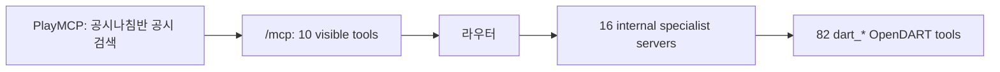

# 카카오 PlayMCP 단일 라우터 운영 핸드북

마지막 확인: **2026-07-19 KST**. 이 문서는 `공시나침반 공시 검색` MCP 하나가
16개 내부 전문 서버와 82개 OpenDART 기능을 라우팅하는 운영 기준이다. 코드 배포와
PlayMCP 등록·심사는 별도 단계다.

## 1. 확정 구조



PlayMCP에 등록하는 MCP는 **하나**다.

| 구분 | 개수 | 역할 |
| --- | ---: | --- |
| 공개 PlayMCP MCP | 1 | `/mcp`, 콘솔에는 10개 gateway 도구가 보임 |
| 내부 전문 서버 | 16 | 공시 도메인별 `SpecialistServerRegistry` 경계 |
| 실제 OpenDART 도구 | 82 | `dart_*` 도구, 내부 전문 서버에 정확히 하나씩 속함 |

PlayMCP의 MCP당 최대 20개 도구 제한은 `tools/list`에 보이는 공개 도구 수에 적용된다.
따라서 82개를 직접 노출하면 안 된다. 대신 다음 두 라우터 도구가 전체 82개 실행을
제공한다.

- `route_and_call_disclosure`: 자연어 질문을 분류해 내부 서버와 도구를 선택·호출한다.
- `call_disclosure_server_tool`: 알고 있는 `server_id`, `tool_name`으로 정확한 내부 도구를 호출한다.

보조 도구 `classify_disclosure_request`, `list_disclosure_servers`는 선택 근거와 전체
도구 카탈로그를 반환한다. `get_company_profile`, `search_disclosures`,
`get_financial_statement`, `get_dividend_information`, `get_major_shareholders`,
`get_employee_statistics`도 동일한 내부 registry를 통해 실행한다.

## 2. PlayMCP 제약과 대응

제공받은 [PlayMCP 서버 개발가이드](https://app.notion.com/p/PlayMCP-2d89b97b4888808a9e1dc17a13e70187)
(2026-06-12 업데이트) 기준이다.

| 항목 | 요구 사항 | 대응 |
| --- | --- | --- |
| 전송 방식 | 공개 Streamable HTTP MCP | HTTPS `/mcp` |
| 프로토콜 | MCP 2025-03-26 이상, 2025-11-25 이하 | FastMCP Streamable HTTP |
| 공개 도구 수 | MCP 서버당 최대 20개 | gateway 10개 |
| 내부 실행 범위 | 콘솔 도구 수와 별도 | 16 서버, 82 `dart_*` 기능을 router가 실행 |
| 도구 메타데이터 | name, description, inputSchema, annotations | gateway와 내부 도구 모두 읽기 전용 annotation 선언 |

콘솔의 `Tools 10`은 오류가 아니라 의도된 공개 API 수다. **82는 공개 도구 목록 수가
아니라 라우터가 실행할 수 있는 내부 기능 수**다.

## 3. 현재 콘솔 상태

실제 콘솔은 [playmcp.kakao.com/console](https://playmcp.kakao.com/console?tab=registered)이다.

| 항목 | 상태 |
| --- | --- |
| 기존 승인 MCP | `Disclosure Compass(공시나침반)` / `dartcompass` / Tools 6 |
| 기존 endpoint | `https://disclosure-compass.playmcp-endpoint.kakaocloud.io/mcp` |
| 새 심사 요청 MCP | `공시나침반 공시 검색` / `dartSearch` |
| 새 endpoint | `https://disclosure-compass-specialists-91883774911.asia-northeast3.run.app/mcp` |
| 새 MCP 상태 | Online, Tools 10, 심사 중 |

새 MCP의 설명은 “자연어 요청을 16개 공시 전문 서버와 82개 OpenDART 도구로 라우팅하는
읽기 전용 MCP”이며, 대표 이미지와 대화 예시 3개도 저장돼 있다.

기존 승인 카드의 Tools 6은 이전 gateway의 등록 메타데이터다. 새 단일 라우터 MCP의
심사가 완료되면 기존 카드를 유지할지, 새 MCP로 대체할지 별도로 결정한다. 기존 카드를
유지해도 새 라우터의 82개 내부 실행 범위에는 영향을 주지 않는다.

## 4. 내부 16 서버와 82 도구 분할

내부 분할은 라우팅·검증용이며, 아래 경로를 PlayMCP에 개별 등록하지 않는다.

| domain ID | 도구 수 | 내부 진단 경로 |
| --- | ---: | --- |
| `disclosure_search` | 4 | `/specialists/disclosure_search/mcp` |
| `shareholder_stock` | 8 | `/specialists/shareholder_stock/mcp` |
| `executive_compensation` | 9 | `/specialists/executive_compensation/mcp` |
| `debt_securities` | 6 | `/specialists/debt_securities/mcp` |
| `audit_fund` | 5 | `/specialists/audit_fund/mcp` |
| `financial_statement` | 7 | `/specialists/financial_statement/mcp` |
| `equity_disclosure` | 2 | `/specialists/equity_disclosure/mcp` |
| `securities_registration` | 6 | `/specialists/securities_registration/mcp` |
| `capital_change` | 4 | `/specialists/capital_change/mcp` |
| `treasury_stock` | 4 | `/specialists/treasury_stock/mcp` |
| `convertible_securities` | 4 | `/specialists/convertible_securities/mcp` |
| `merger_division` | 4 | `/specialists/merger_division/mcp` |
| `business_transfer` | 5 | `/specialists/business_transfer/mcp` |
| `overseas_listing` | 4 | `/specialists/overseas_listing/mcp` |
| `equity_investment` | 3 | `/specialists/equity_investment/mcp` |
| `corporate_issues` | 7 | `/specialists/corporate_issues/mcp` |
| **합계** | **82** | **16 internal servers** |

정확한 도구명·OpenDART endpoint·한국어 라벨의 단일 원천은
[`SPECIALIST_TOOLS`](../src/opendart_mcp/specialists.py)다.

## 5. 배포와 갱신 절차

1. `v1.2.2`를 Cloud Run `disclosure-compass-specialists`에 배포한다.
2. `/mcp`의 10개 도구와 `route_and_call_disclosure` 실제 호출을 검증한다.
3. PlayMCP `공시나침반 공시 검색` 카드의 endpoint는 반드시 `/mcp`다.
4. endpoint나 도구 설명을 변경하면 카드 메뉴의 `수정 → 정보 불러오기 → 저장하기`를
   수행한다. 심사 중 변경이 심사 재요청을 요구하는지 콘솔 상태를 확인한다.
5. `/specialists/<domain>/mcp` 경로 16개를 새 PlayMCP MCP로 등록하지 않는다.

새 edge에는 OpenDART 키를 복제하지 않는다. 현재 edge는
`OPENDART_UPSTREAM_GATEWAY_URL=https://disclosure-compass.playmcp-endpoint.kakaocloud.io/mcp`
로 기존 승인 gateway의 `call_disclosure_server_tool` 계약을 이용한다. 직접 운영으로
전환할 때만 런타임 secret `DART_API_KEY`를 주입한다.

## 6. 배포 검증

```bash
PUBLIC_MCP_BASE_URL='https://disclosure-compass-specialists-91883774911.asia-northeast3.run.app'

.venv/bin/python - <<'PY'
import asyncio
import os
from fastmcp import Client

async def main():
    async with Client(os.environ['PUBLIC_MCP_BASE_URL'].rstrip('/') + '/mcp') as client:
        tools = {tool.name for tool in await client.list_tools()}
        assert len(tools) == 10
        assert {'classify_disclosure_request', 'list_disclosure_servers',
                'call_disclosure_server_tool', 'route_and_call_disclosure'} <= tools
        result = await client.call_tool('route_and_call_disclosure', {
            'query': '삼성전자 기업 개황을 알려줘',
            'corp_code': '00126380',
        })
    assert result.data['selected_server'] == 'disclosure_search'
    assert result.data['selected_tool'] == 'dart_company'
    assert result.data['result']['status'] == 'ok'
    print('public router verified: 10 visible tools, 16 internal servers, 82 capabilities')

asyncio.run(main())
PY
```

검증 시 `Tools 10`과 내부 실행 범위 `16/82`를 혼동하지 않는다. 심사 완료 뒤에는
16개 도메인을 대표하는 자연어 질문을 각각 한 번씩 실행해 라우팅 회귀를 확인한다.

## 7. 관련 문서

- [PlayMCP 서버 개발가이드](https://app.notion.com/p/PlayMCP-2d89b97b4888808a9e1dc17a13e70187)
- [서비스 도움말](https://app.notion.com/p/2189b97b4888803dbbdcef264e7eff58)
- [MCP 도구 정보 갱신 도움말](https://app.notion.com/p/MCP-2389b97b488880b3896bceb076899938)
- [구현·배포 기록](IMPLEMENTATION_DEPLOYMENT_KO.md)
- [README](../README.md)
